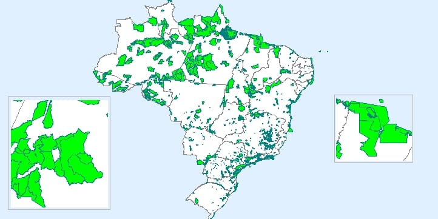

# Análise dos dados sobre as unidades de conservação no Brasil

## Sumário

- [Introdução](https://github.com/fernandessfae/dados_ucs_2025?tab=readme-ov-file#introdu%C3%A7%C3%A3o)
- [Panorama Nacional](https://github.com/fernandessfae/dados_ucs_2025?tab=readme-ov-file#panorama-nacional)
- [Panorama Regional](https://github.com/fernandessfae/dados_ucs_2025?tab=readme-ov-file#panorama-regional)
    - [Região Norte](https://github.com/fernandessfae/dados_ucs_2025?tab=readme-ov-file#regi%C3%A3o-norte)
    - [Região Nordeste](https://github.com/fernandessfae/dados_ucs_2025?tab=readme-ov-file#regi%C3%A3o-nordeste)
    - [Região Centro-Oeste](https://github.com/fernandessfae/dados_ucs_2025?tab=readme-ov-file#regi%C3%A3o-centro-oeste)
    - [Região Sudeste](https://github.com/fernandessfae/dados_ucs_2025?tab=readme-ov-file#regi%C3%A3o-sudeste)
    - [Região Sul](https://github.com/fernandessfae/dados_ucs_2025?tab=readme-ov-file#regi%C3%A3o-sul)
- [Comparação UCs Nacional x UCs Regional](https://github.com/fernandessfae/dados_ucs_2025?tab=readme-ov-file#compara%C3%A7%C3%A3o-ucs-nacional-x-ucs-regional)
- [Conclusão](https://github.com/fernandessfae/dados_ucs_2025?tab=readme-ov-file#conclus%C3%A3o)

## Introdução

As unidades de conservação (<b>UC</b>) são dermacações de terra, protegido por lei, onde o Instituto Chico Mendes de Conservação (<b>ICMBio</b>), orgão vinculado ao ministério de Meio Ambiente (<b>IBAMA</b>), é o principal responsável por isso. São criadas pelo fato de possuírem características naturais relevantes, como fauna, flora e ecossistema únicos. As finalidades delas são:    

**1) Preservação da biodiversidade**: Conservam fauna e flora, ameaçadas de extinção, e seus habitats naturais. 
**2) Conservação dos recursos naturais**: As UCs garantem a proteção de recursos como água, solo e ar, essenciais para a vida no planeta.  
**3) Manutenção dos serviços ecossistêmicos**: As UCs desempenham um papel fundamental na manutenção dos serviços ecossistêmicos, como a polinização, a regulação do clima e a purificação da água.  
**4) Desenvolvimento Sustentável**: As UCs podem promover o desenvolvimento sustentável das comunidades locais, por meio do ecoturismo e da geração de renda com o uso sustentável dos recursos naturais.  
**5) Pesquisa científica e educação ambiental**: As UCs são importantes áreas para a pesquisa científica e para a educação ambiental, contribuindo para o conhecimento e a conscientização sobre a importância da conservação da natureza.  
Além disso, as UCs são divididas em dois principais grupos:  1) <b>Unidades de proteção integral</b> onde a prioridade é a <b>preservação total do ecossistema</b>, sendo permitido apenas o uso indireto dos recursos naturais, como pesquisas científicas e ecoturismo. Podemos citar como exemplo os parques nacionais, reservas biológicas e estações ecológicas.  2) <b>Unidades de uso sustentável</b>, onde é permitido <b>o uso sustentável dos recursos naturais</b>, conciliando a conservação da natureza com o desenvolvimento socioeconômico das comunidades locais, como as áreas de proteção ambiental, reservas extrativistas e florestas nacionais. 

O processo de demarcação das unidades de conservação leva em consideração os seguintes critérios:  
* <b>Estudos técnicos</b>: São feitos com o intuito de identificar os limites da UC, levando em consideração aspectos como biodiversidade, os recursos naturais, o uso da terra e a presença de comunidades tradicionais.
* <b>Consulta pública</b>: É realizada uma consulta pública com o intuito de garantir a participação da sociedade no processo de demarcação, permitindo que os participantes expressem suas opiniões e preocupações sobre as demarcações.
* <b>Regularização fundiária</b>: É realizada a regularização fundiária da área, que pode envolver a desapropriação de terras e a negociação com os proprietários.
* <b>Demarcação física</b>: Os limites da UC são demarcados fisicamente no terreno, com a instalação de marcos e placas. 

Os principais orgãos e atores envolvidos no processo de demarcação das Unidades de Conservação (UC) são: <b>ICMBio</b> - principal responsável pela demarcação das UCs federais, <b>Ministério do Meio Ambiente (MMA)</b> - supervisiona o processo de demarcação e define as políticas públicas para a criação e gestão das UCs, <b>Órgãos Estaduais e Municipais</b> - Participam do processo de demarcação das UCs estaduais e municipais, <b>Comunidades tradicionais</b> - têm um papel fundamental no processo de demarcação, especialmente nas UCs de uso sustentável e <b>Organizações Não-Governamentais (ONG)</b> - podem participar do processo de demarcação, oferecendo apoio técnico e jurídico.

Após essa breve explicação do que são as unidades de conservação, agora iremos para a análise de dados propiamente dita.

## Panorama Nacional

De acordo com os dados disponibilizados pelo ICMBio até o mês de fevereiro de 2025, cujo <a href='https://github.com/fernandessfae/dados_ucs_2025/blob/master/dadosgeoestatisticos_ucs_27fev2025.xlsx'>arquivo</a> dele estará presente no repositório, o Brasil possui as seguintes informações sobre as suas unidades de conservação:
 

Unidades Conservação no Brasil (2016) - Fonte: <a>GISMAP</a>
 

    <ul>
        <li><b>Quantidade</b>: Cerca de 340 unidades de conservação espalhados por todo o Brasil.</li>
        <li><b>Área</b>: Em termos gerais, somando a área de todas as UCs, isso dá o resultado de 171.783.147,3 hectares, cerca de <b>1.717.831,47 km²</b>. Para termos de comparação, o estado de Sergipe, o menor estado brasileiro, tem 21.938 km² de área, ou seja, as áreas de todas as unidades de conservação somadas dão cerca de, aproximadamente, <b>78 vezes a área do estado de Sergipe.</b> A área média, por unidade de conservação, é de 505.244,55 hectares, cerca de <b>5.052,44 km²</b>.</li>
        <li><b>Maior UC</b>: A maior unidade de conservação fica localizado no estado da <b>Bahia</b>. É a área de proteção ambiental do <b>arquipélago Trindade e Martins Vaz</b>, possuindo uma área de 40.385.419,58 hectares, cerca de <b>403.854,2 km²</b>. </li>
        <li><b>Menor UC</b>: A menor unidade de conservação fica localizado no estado de <b>São Paulo</b>. São as <b>ilhas da queimada pequena e queimada grande</b>, possuindo uma área de 65,17 hectares, cerca de <b>0,65 km²</b>.</li>
        <li><b>Biomas</b>: Abaixo estará uma tabela com os biomas presentes, ou predominantes, nas unidades de conservação em todo o país.   
        <table>
            <tr>
            <th>Bioma</th>
            <th>UCs Presentes</th>
            </tr>
            <tr style="background-color: #f2f2f2;">
            <th>Amazônia</th>
            <th>133</th>
            </tr>
            <tr>
            <th>Mata Atlântica</th>
            <th>104</th>
            </tr>
            <tr style="background-color: #f2f2f2;">
            <th>Cerrado</th>
            <th>46</th>
            </tr>
            <tr>
            <th>Caatinga</th>
            <th>28</th>
            </tr>
            <tr style="background-color: #f2f2f2;">
            <th>Sistema Costeiro-Marinho</th>
            <th>24</th>
            </tr>
            <tr>
            <th>Pampa</th>
            <th>3</th>
            </tr>
            <tr style="background-color: #f2f2f2;">
            <th>Pantanal</th>
            <th>2</th>
            </tr>
        </table>
        </li> 
    </ul>
    Podemos ver que a maioria das unidades de conservação, cerca de, aproximadamente, <b>70%</b> possui a <b>amazônia</b> e a <b>mata atlântica</b> como biomas principais e/ou predominantes.

## Panorama Regional

Como pode ser observado anteriormente, existem cerca de 340 Unidades de conservação espalhadas por todo o Brasil, de acordo com os dados levantados até o presente ano (2025). Para poder fazer uma melhor gestão das UCs, o ICMBio decidiu criar coordenações regionais para tal feito. Atualmente, existem cerca de 5 coordenações regionais - 1 para cada região brasileira -, e na tabela abaixo existem o número de unidades de conservação por região:  
    <table>
        <tr style="background-color: #f2f2f2;">
        <th>Gerência Regional</th>
        <th>Quantidade UCs</th>
        </tr>
        <tr>
        <th>GR1 - Norte</th>
        <th>133</th>
        </tr>
        <tr style="background-color: #f2f2f2;">
        <th>GR2 - Nordeste</th>
        <th>80</th>
        </tr>
        <tr>
        <th>GR3 - Centro-Oeste</th>
        <th>24</th>
        </tr>
        <tr style="background-color: #f2f2f2;">
        <th>GR4 - Sudeste</th>
        <th>62</th>
        </tr>
        <tr>
        <th>GR5 - Sul</th>
        <th>41</th>
        </tr>
        <tr>
    </table> 
   Comparando com a tabela de biomas do 'panorama nacional', é seguro dizer que a coordenação regional <b>GR1</b> cuida cerca de, aproximadamente, <b>39,1%</b> de todas as unidades de conservação no país cujo bioma predominante é a <b>amazônia</b>. Logo abaixo, veremos as informações mais detalhadas sobre essa coordenação e muitas outras.   

### Região Norte

    <ul>
        <li><b>Quantidade</b>: Cerca de 133 unidades de conservação presentes na região Norte.</li>
        <li><b>Área</b>: Em termos gerais, somando a área de todas as UCs, isso dá o resultado de 62.012.551,7 hectares, cerca de <b>620.125,52 km²</b>. Para termos de comparação, o estado de Sergipe, o menor estado brasileiro, tem 21.938 km² de área, ou seja, as áreas de todas as unidades de conservação somadas dão cerca de, aproximadamente, <b>28 vezes a área do estado de Sergipe.</b> A área média, por unidade de conservação, é de 466.259,79 hectares, cerca de <b>4.662,6 km²</b>.</li>
        <li><b>Maior UC</b>: A maior unidade de conservação fica localizado no estado do <b>Amapá</b>. É o <b>Parque Nacional Montanhas do Tumucumaque</b>, possuindo uma área de 3.865.172,48 hectares, cerca de <b>38.651,72 km²</b>. </li>
        <li><b>Menor UC</b>: A menor unidade de conservação fica localizado no estado do <b>Amazonas</b>. É a <b>Floresta Nacional Mapiá - Inauini</b>, possuindo uma área de 495,99 hectares, cerca de <b>4,96 km²</b>.</li>
        <li><b>Biomas</b>: Abaixo estará uma tabela com os biomas presentes, ou predominantes, nas unidades de conservação na região Norte.   
        <table>
            <tr style="background-color: #f2f2f2;">
            <th>Bioma</th>
            <th>UCs Presentes</th>
            </tr>
            <tr>
            <th>Amazônia</th>
            <th>130</th>
            </tr>
            <tr style="background-color: #f2f2f2;">
            <th>Sistema Costeiro-Marinho</th>
            <th>3</th>
            </tr>
        </table>
        </li> 
    </ul>

### Região Nordeste

<ul>
        <li><b>Quantidade</b>: Cerca de 80 unidades de conservação presentes na região Nordeste.</li>
        <li><b>Área</b>: Em termos gerais, somando a área de todas as UCs, isso dá o resultado de 98.329.665,57 hectares, cerca de <b>983.296,65 km²</b>. Para termos de comparação, o estado de Sergipe, o menor estado brasileiro, tem 21.938 km² de área, ou seja, as áreas de todas as unidades de conservação somadas dão cerca de, aproximadamente, <b>44 vezes a área do estado de Sergipe.</b> A área média, por unidade de conservação, é de 505.244,55 hectares, cerca de <b>12.291,21 km²</b>.</li>
        <li><b>Maior UC</b>: A maior unidade de conservação fica localizado no estado da <b>Bahia</b>. É a área de proteção ambiental do <b>arquipélago Trindade e Martins Vaz</b>, possuindo uma área de 40.385.419,58 hectares, cerca de <b>403.854,2 km²</b>. </li>
        <li><b>Menor UC</b>: A menor unidade de conservação fica localizado no estado da <b>Paraíba</b>. É a <b>Floresta Nacional da Restinga de Cabedelo</b>, possuindo uma área de 113,27 hectares, cerca de <b>1,14 km²</b>.</li>
        <li><b>Biomas</b>: Abaixo estará uma tabela com os biomas presentes, ou predominantes, nas unidades de conservação na região Nordeste.   
        <table>
            <tr>
            <th>Bioma</th>
            <th>UCs Presentes</th>
            </tr>
            <tr style="background-color: #f2f2f2;">
            <th>Amazônia</th>
            <th>2</th>
            </tr>
            <tr>
            <th>Mata Atlântica</th>
            <th>27</th>
            </tr>
            <tr style="background-color: #f2f2f2;">
            <th>Cerrado</th>
            <th>12</th>
            </tr>
            <tr>
            <th>Caatinga</th>
            <th>28</th>
            </tr>
            <tr style="background-color: #f2f2f2;">
            <th>Sistema Costeiro-Marinho</th>
            <th>11</th>
            </tr>
        </table>
        </li> 
    </ul>

### Região Centro-Oeste

    <ul>
        <li><b>Quantidade</b>: Cerca de 24 unidades de conservação presentes na região Centro-Oeste.</li>
        <li><b>Área</b>: Em termos gerais, somando a área de todas as UCs, isso dá o resultado de 5.252.772,91 hectares, cerca de <b>52.527,73 km²</b>. Para termos de comparação, o estado de Sergipe, o menor estado brasileiro, tem 21.938 km² de área, ou seja, as áreas de todas as unidades de conservação somadas dão cerca de, aproximadamente, <b>2 vezes a área do estado de Sergipe.</b> A área média, por unidade de conservação, é de 218.865,54 hectares, cerca de <b>2.188,65 km²</b>.</li>
        <li><b>Maior UC</b>: A maior unidade de conservação fica localizado na divisa entre os estados de <b>Mato Grosso e Amazonas</b>. É o <b>Parque Nacional do Juruena</b>, possuindo uma área de 1.958.014,42 hectares, cerca de <b>19.580,14 km²</b>. </li>
        <li><b>Menor UC</b>: A menor unidade de conservação fica localizado no estado de <b>Goiás</b>. É a <b>Floresta Nacional de Silvânia</b>, possuindo uma área de 486,61 hectares, cerca de <b>4,87 km²</b>.</li>
        <li><b>Biomas</b>: Abaixo estará uma tabela com os biomas presentes, ou predominantes, nas unidades de conservação na região Centro-Oeste.   
        <table>
            <tr style="background-color: #f2f2f2;">
            <th>Bioma</th>
            <th>UCs Presentes</th>
            </tr>
            <tr>
            <th>Amazônia</th>
            <th>1</th>
            </tr>
            <tr style="background-color: #f2f2f2;">
            <th>Cerrado</th>
            <th>21</th>
            </tr>
            <tr>
            <th>Pantanal</th>
            <th>2</th>
            </tr>
        </table>
        </li> 
    </ul>

### Região Sudeste

    <ul>
        <li><b>Quantidade</b>: Cerca de 62 unidades de conservação presentes na região Sudeste.</li>
        <li><b>Área</b>: Em termos gerais, somando a área de todas as UCs, isso dá o resultado de 3.509.547,12 hectares, cerca de <b>35.095,47 km²</b>. Para termos de comparação, o estado de Sergipe, o menor estado brasileiro, tem 21.938 km² de área, ou seja, as áreas de todas as unidades de conservação somadas dão cerca de, aproximadamente, <b>a área do estado de Sergipe.</b> A área média, por unidade de conservação, é de 505.244,55 hectares, cerca de <b>566,05 km²</b>.</li>
        <li><b>Maior UC</b>: A maior unidade de conservação fica localizado na tríplice divisa entre os estados de <b>Minas Gerais, Rio de Janeiro e São Paulo</b>. É a área de proteção ambiental da <b>Serra da Mantiqueira</b>, possuindo uma área de 437.525,10  hectares, cerca de <b>4,37 km²</b>. </li>
        <li><b>Menor UC</b>: A menor unidade de conservação fica localizado no estado de <b>São Paulo</b>. São as <b>ilhas da queimada pequena e queimada grande</b>, possuindo uma área de 65,17 hectares, cerca de <b>0,65 km²</b>.</li>
        <li><b>Biomas</b>: Abaixo estará uma tabela com os biomas presentes, ou predominantes, nas unidades de conservação na região Sudeste.   
        <table>
            <tr style="background-color: #f2f2f2;">
            <th>Bioma</th>
            <th>UCs Presentes</th>
            </tr>
            <th>Mata Atlântica</th>
            <th>42</th>
            </tr>
            <tr style="background-color: #f2f2f2;">
            <th>Cerrado</th>
            <th>13</th>
            </tr>
            <tr>
            <th>Sistema Costeiro-Marinho</th>
            <th>7</th>
            </tr>
        </table>
        </li> 
    </ul>

### Região Sul

    <ul>
        <li><b>Quantidade</b>: Cerca de 41 unidades de conservação presentes na região Sul.</li>
        <li><b>Área</b>: Em termos gerais, somando a área de todas as UCs, isso dá o resultado de 2.678.610,01 hectares, cerca de <b>26.786,1 km²</b>. Para termos de comparação, o estado de Sergipe, o menor estado brasileiro, tem 21.938 km² de área, ou seja, as áreas de todas as unidades de conservação somadas dão cerca de, aproximadamente, <b>a área do estado de Sergipe.</b> A área média, por unidade de conservação, é de 65.331,95 hectares, cerca de <b>653,32 km²</b>.</li>
        <li><b>Maior UC</b>: A maior unidade de conservação fica localizado na tríplice divisa entre os estados do <b>Paraná, São Paulo e Mato Grosso do Sul</b>. É a área de proteção ambiental das <b>ilhas e várzeas do rio Paraná</b>, possuindo uma área de 1.005.188,39 hectares, cerca de <b>10.051,88 km²</b>. </li>
        <li><b>Menor UC</b>: A menor unidade de conservação fica localizado no estado do <b>Rio Grande do Sul</b>. É o <b>refúgio de vida silvestre da Ilha dos Lobos</b>, possuindo uma área de 142,39 hectares, cerca de <b>1,42 km²</b>.</li>
        <li><b>Biomas</b>: Abaixo estará uma tabela com os biomas presentes, ou predominantes, nas unidades de conservação na região Sul.   
        <table>
            <tr style="background-color: #f2f2f2;">
            <th>Bioma</th>
            <th>UCs Presentes</th>
            </tr>
            <tr>
            <th>Mata Atlântica</th>
            <th>35</th>
            <tr style="background-color: #f2f2f2;">
            <th>Sistema Costeiro-Marinho</th>
            <th>3</th>
            </tr>
            <tr>
            <th>Pampa</th>
            <th>3</th>
            </tr>
        </table>
        </li>
    </ul>

## Comparação UCs Nacional x UCs Regional

Após ver, com mais detalhes, as informações encontradas, em cada região, agora vamos ver, na tabela abaixo, a comparação entre as informações encontradas sobre cada região, em relação a área, e compará-las:   
    <table>
        <tr style="background-color: #f2f2f2;">
            <th>Unidades Conservação (UC)</th>
            <th>GR1 - Norte</th>
            <th>GR2 - Nordeste</th>
            <th>GR3 - Centro-Oeste</th>
            <th>GR4 - Sudeste</th>
            <th>GR5 - Sul</th>
            <th>Nacional</th>
        </tr>
        <tr>
            <th>Quantidade</th>
            <th>133</th>
            <th>80</th>
            <th>24</th>
            <th>62</th>
            <th>41</th>
            <th>340</th>
        </tr>
        <tr style="background-color: #f2f2f2;">
            <th>Área Total (km²)</th>
            <th>620.125,52</th>
            <th>983.296,65</th>
            <th>52.527,73</th>
            <th>35.095,47</th>
            <th>26.786,1</th>
            <th>1.717.831,47</th>
        </tr>
        <tr>
            <th>Área média por UC (km²)</th>
            <th>4.662,6</th>
            <th>12.291,21</th>
            <th>2.188,65</th>
            <th>566,05</th>
            <th>653,32</th>
            <th>5.052,44</th>
        </tr>
        <tr style="background-color: #f2f2f2;">
            <th>Menor área de UC (km²)</th>
            <th>4,96</th>
            <th>1,14</th>
            <th>4,87</th>
            <th>4,37</th>
            <th>1,42</th>
            <th>1,14</th>
        </tr>
        <tr>
            <th>Maior área de UC (km²)</th>
            <th>38.651,72</th>
            <th>403.854,2</th>
            <th>19.580,14</th>
            <th>566,05</th>
            <th>10.051,88</th>
            <th>403.854,2</th>
        </tr>
    </table> 
Com essa tabela, pode-se extrair dados relevantes como:  
    <ul>
        <li>A <b>maior quantidade</b> de unidades de conservação está localizado na <b>região Norte</b>.</li>
        <li>A <b>região Nordeste</b> possui a <b>maior área somada</b> de todas as unidades de conservação.</li>
        <li>A <b>região Nordeste</b> possui a <b>maior área média por UC</b> de todas as regiões do Brasil, ultrapassando a área média nacional em torno de 2,5 vezes, aproximadamente.</li>
        <li>A <b>menor área</b> de UC está localizada na <b>região Nordeste</b>.</li>
        <li>A <b>maior área</b> de UC está localizada na <b>região Nordeste</b>.</li>
    </ul>
Abaixo, veremos uma outra tabela, referente aos bioma presente, ou predominantes, nas unidades de conservação em cada região:  
<table>
    <tr style="background-color: #f2f2f2;">
            <th>Biomas Unidades Conservação (UC)</th>
            <th>GR1 - Norte</th>
            <th>GR2 - Nordeste</th>
            <th>GR3 - Centro-Oeste</th>
            <th>GR4 - Sudeste</th>
            <th>GR5 - Sul</th>
            <th>Nacional</th>
    </tr>
    <tr>
        <th>Amazônia</th>
        <th>130</th>
        <th>2</th>
        <th>1</th>
        <th>-</th>
        <th>-</th>
        <th>133</th>
    </tr>
    <tr style="background-color: #f2f2f2;">
        <th>Mata Atlântica</th>
        <th>-</th>
        <th>27</th>
        <th>-</th>
        <th>42</th>
        <th>35</th>
        <th>104</th>
    </tr>
    <tr>
        <th>Cerrado</th>
        <th>-</th>
        <th>12</th>
        <th>21</th>
        <th>13</th>
        <th>-</th>
        <th>46</th>
    </tr>
    <tr style="background-color: #f2f2f2;">
        <th>Caatinga</th>
        <th>-</th>
        <th>28</th>
        <th>-</th>
        <th>-</th>
        <th>-</th>
        <th>28</th>
    </tr>
    <tr>
        <th>Sistema Costeiro Marinho</th>
        <th>3</th>
        <th>11</th>
        <th>-</th>
        <th>7</th>
        <th>3</th>
        <th>24</th>
    </tr>
    <tr style="background-color: #f2f2f2;">
        <th>Pampas</th>
        <th>-</th>
        <th>-</th>
        <th>-</th>
        <th>-</th>
        <th>3</th>
        <th>3</th>
    </tr>
    <tr>
        <th>Pantanal</th>
        <th>-</th>
        <th>-</th>
        <th>2</th>
        <th>-</th>
        <th>-</th>
        <th>2</th>
    </tr>
</table>
Com essas informações dos biomas acima, dá para obter as seguintes informações:  
<ul>
    <li>O bioma <b>amazônia</b> está concentrado na UCs da <b>região Norte</b>.</li>
    <li>A <b>região Nordeste</b> possui UCs com a maior variabilidade de biomas.</li>
    <li>As <b>regiões Centro-Oeste</b>, <b>Nordeste</b> e <b>Sul</b> possuis UCs com biomas exclusivos: <b>pantanal</b>, <b>caatinga</b> e <b>pampas</b>, respectivamente.</li>
    <li>O bioma <b>sistema costeiro marinho</b> está presente nas UCs da maioria das regiões do Brasil.</li>
</ul>

## Conclusão

Com uma simples análise de dados, já foi possivel entender o panorama geral da unidades de conservação em todo o Brasil, assim como nas suas regiões. Também foi importante entender os biomas presentes em cada região. Assim fica importante entender e propor as melhores soluções para algum problema que venha a surgir. 

